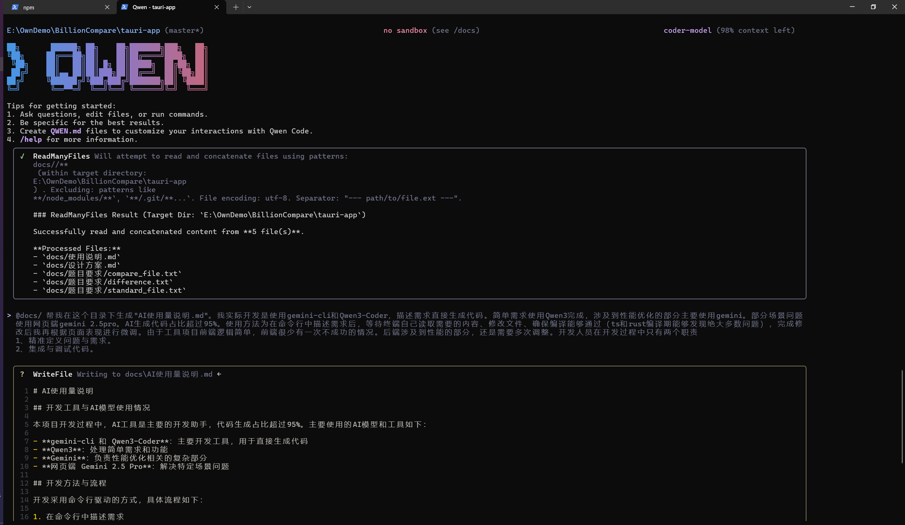

# AI使用量说明

## 开发工具与AI模型使用情况

本项目开发过程中，由于核心逻辑代码量不多1M token上下文可轻松应对，因此开发不从零手写任何逻辑，仅对AI生成的文件进行微调。代码生成占比超过95%。主要使用的AI模型和工具如下：

- **gemini-cli 和 Qwen3-Coder**：主要开发工具，用于直接生成代码
- **Qwen3**：处理简单需求和功能
- **Gemini**：负责性能优化相关的复杂部分
- **网页端 Gemini 2.5 Pro**：解决特定场景问题

## 开发方法与流程

开发采用命令行驱动的方式，具体流程如下：

1. 开发者在命令行中描述需求
2. AI自动读取项目内容、修改文件、确保编译通过（TypeScript 和 Rust 编译器发现大部分问题）
4. 完成修改后根据页面表现进行微调

### 前端开发特点
- 前端逻辑简单，使用AI生成的代码很少需要二次修改
- 终端自动完成大部分代码生成和修改工作

### 后端开发特点
- 涉及性能优化的部分通常需要多次调整
- 复杂算法和性能优化相关代码需要反复迭代

## 开发人员职责

在AI辅助开发模式下，开发人员的主要职责转变为：

1. **精准定义问题与需求**：清晰、准确地描述需要实现的功能或解决的问题
2. **集成与调试代码**：整合AI生成的代码，进行最终的调试和验证，确认AI方案的性能改进效果

这种模式大幅提升了开发效率，使开发者能够专注于业务逻辑和系统架构设计，而非具体的编码实现细节。例如本文档就是用prompt直接产生的
